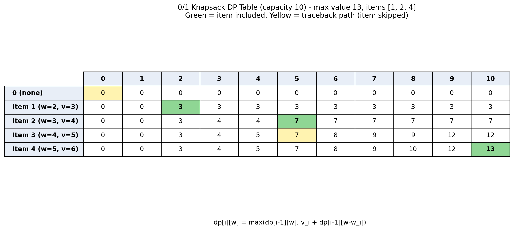

# 0/1 Knapsack Using Dynamic Programming

## Overview

This project implements the **0/1 Knapsack Problem** using **Dynamic Programming**. The application allows users to enter item weights, values, and knapsack capacity, and displays the DP table along with the selected items.

## Objective

* Solve the 0/1 Knapsack problem using Dynamic Programming.
* Visualize the DP table.
* Find the maximum achievable value.
* Identify the items included in the optimal solution.

## Technologies Used

* HTML
* CSS
* JavaScript
* Dynamic Programming

## Algorithm

Let `dp[i][w]` represent the maximum value obtainable using the first `i` items with capacity `w`.

For each item:

```text
dp[i][w] = dp[i-1][w]                         // exclude item

dp[i][w] = max(dp[i-1][w],
               val[i-1] + dp[i-1][w-wt[i-1]]) // include item
```

The final answer is:

```text
dp[n][C]
```

The selected items are determined by tracing back through the DP table.

## Example

```text
Weights  : 2 3 4 5
Values   : 3 4 5 6
Capacity : 10
```

The application generates the DP table and displays the maximum value and the items selected.

## Complexity

* **Time:** `O(n × C)`
* **Space:** `O(n × C)`

## How to Run

1. Open `knapsack.html` in Chrome, Edge, or another modern browser.
2. Enter the weights, values, and capacity.
3. Click **Show Table**.
4. View the maximum value, selected items, and DP table.

## Output

The application displays the complete DP table, highlights the selected items, and shows the traceback path used to obtain the optimal solution.

### Output Screenshot



## Conclusion

This project demonstrates how **Dynamic Programming** can be used to efficiently solve the 0/1 Knapsack optimization problem and visualize the process through a DP table.
