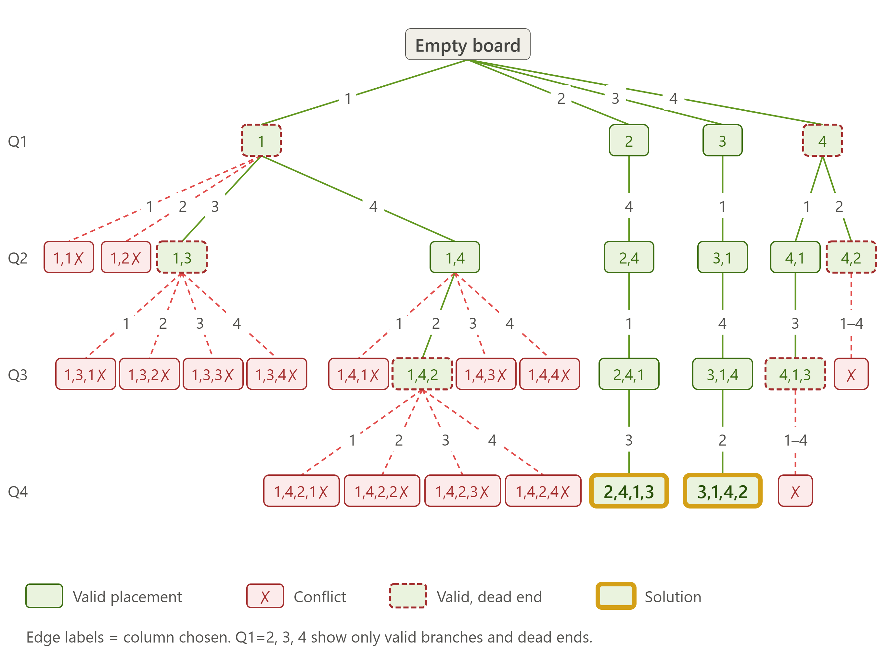

# N-Queens Problem using Backtracking

## Description
Implements N-Queens (N=4) using backtracking and visualizes the state space
tree through prompt engineering.

## Algorithm
(paste pseudocode from Step 1)

## Prompt Used
(paste prompt from Step 4)

## Output

Solutions found: [2,4,1,3] and [3,1,4,2]

## Explanation
(paste Step 6)

## Learning Outcome
- Understood recursive backtracking and pruning.
- Learned prompt-based visualization.
- Practiced GitHub documentation.